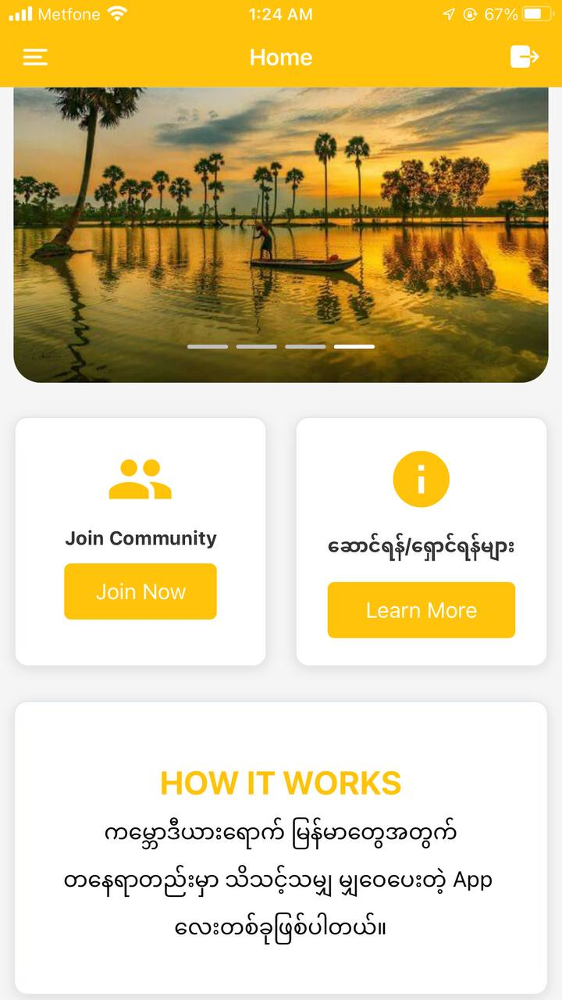
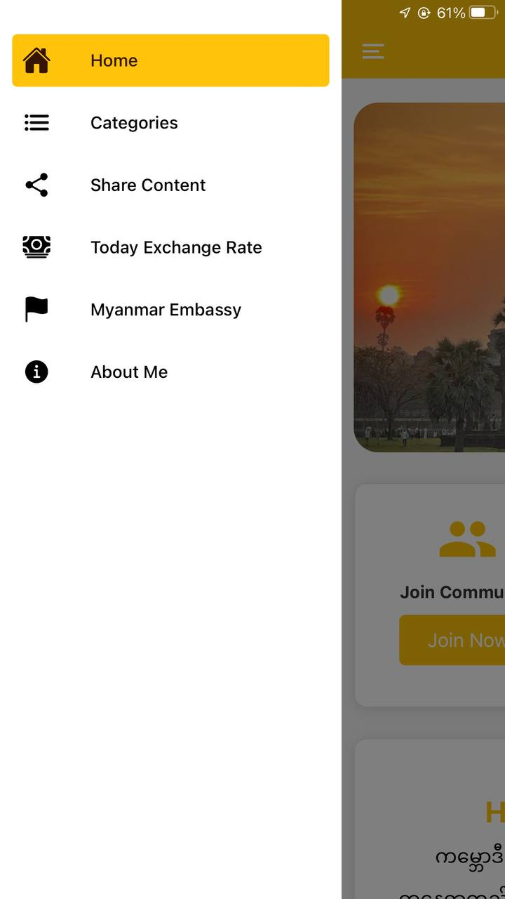
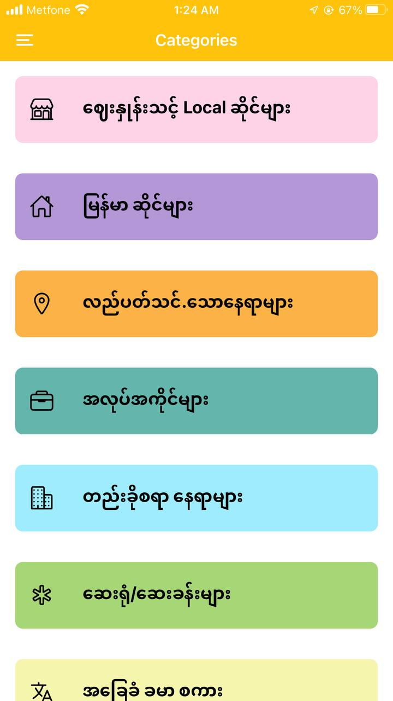

# Myanmar in Cambodia Information App

This application is designed to provide useful information for Myanmar people living in Cambodia.

## Features

- **Location Information:** Find information about various locations in Cambodia that are relevant to Myanmar people, such as restaurants, grocery stores, temples, etc.
- **Community Events:** Stay updated about community events, gatherings, festivals, and other important occasions for the Myanmar community in Cambodia.
- **Language Assistance:** Get help with language barriers by accessing translation services or language learning resources tailored for Myanmar speakers in Cambodia.
- **Legal and Administrative Support:** Access information about legal requirements, administrative procedures, and relevant government offices for Myanmar expatriates in Cambodia.
- **Cultural Exchange:** Engage in cultural exchange activities, connect with local Cambodian communities, and participate in events promoting cultural understanding and integration.

## Installation

To use the Myanmar in Cambodia Information App, follow these steps:

1. Clone the repository to your local machine.
2. Install the necessary dependencies using `npm install`.
3. Run the application using `npm start`.

## Contributing

If you would like to contribute to the development of this application, please follow these guidelines:

1. Fork the repository.
2. Create a new branch for your feature or bug fix.
3. Make your changes and ensure they adhere to the project's coding standards.
4. Test your changes thoroughly.
5. Submit a pull request with a clear description of your changes.

## Feedback

Your feedback is valuable to us! If you have any suggestions, feature requests, or encounter any issues while using the application, please [open an issue](https://github.com/HtetKo510217/myanmar-in-cambodia/issues) on GitHub.

## License

This project is licensed under the MIT License. See the [LICENSE](LICENSE) file for details.

## Screenshots

